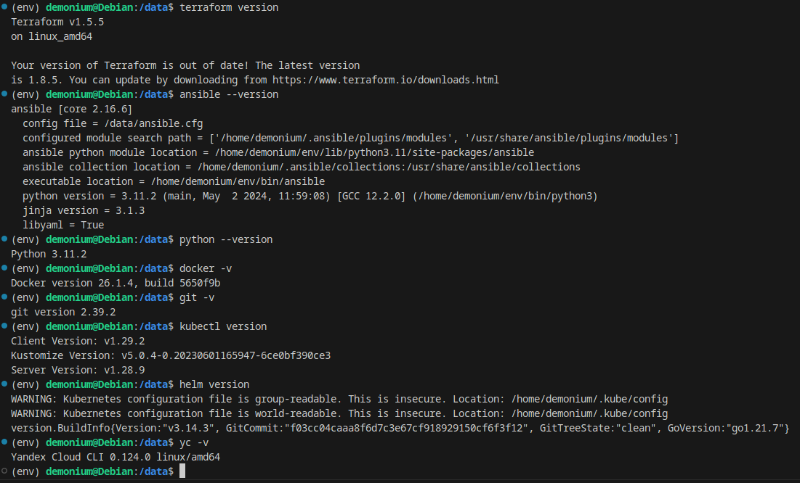
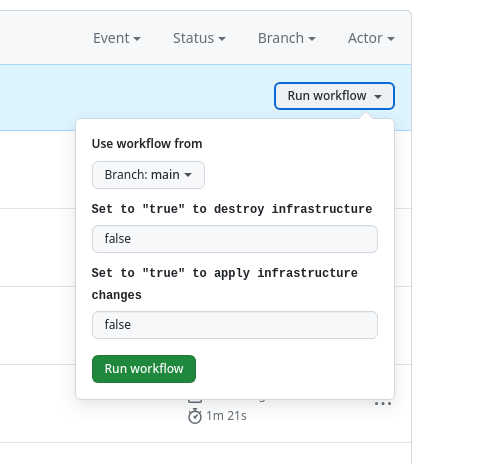
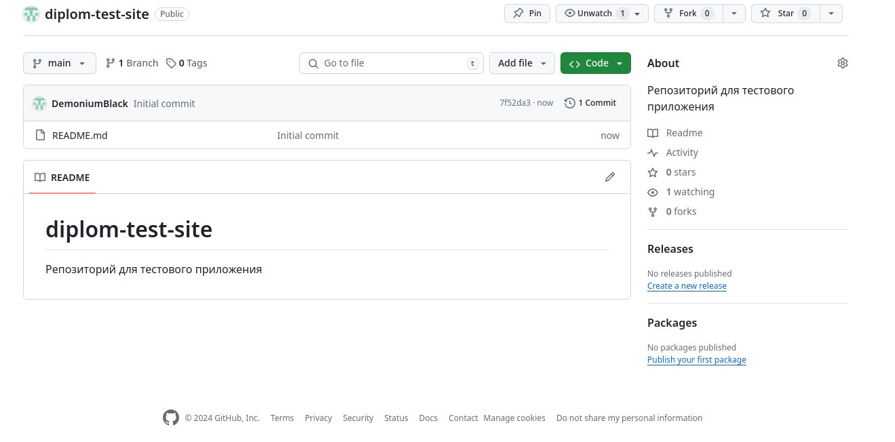
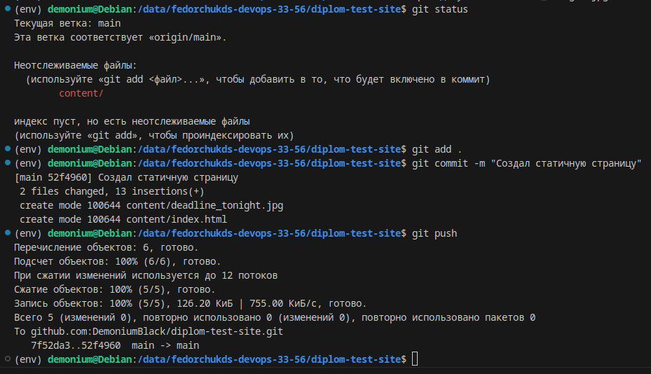
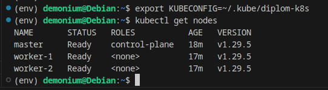
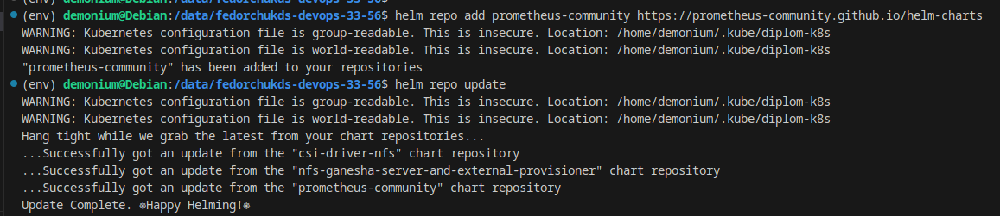
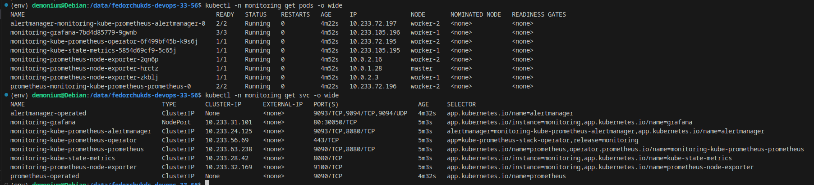
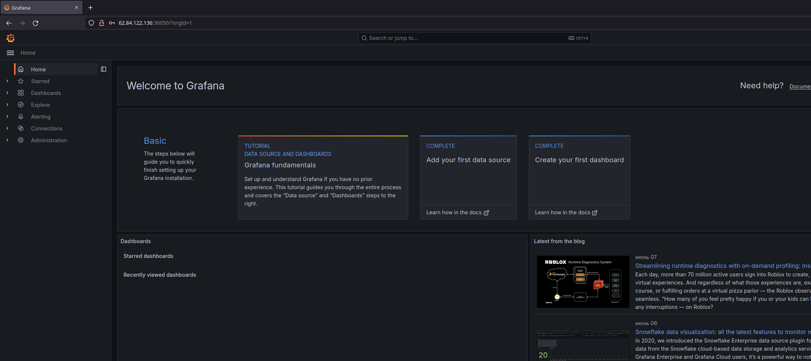

# Автор: Федорчук Дмитрий Сергеевич DEVOPS-33

# Дипломный практикум в Yandex.Cloud
  * [Цели:](#цели)
  * [Этапы выполнения:](#этапы-выполнения)
     * [Создание облачной инфраструктуры](#создание-облачной-инфраструктуры)
     * [Создание Kubernetes кластера](#создание-kubernetes-кластера)
     * [Создание тестового приложения](#создание-тестового-приложения)
     * [Подготовка cистемы мониторинга и деплой приложения](#подготовка-cистемы-мониторинга-и-деплой-приложения)
     * [Установка и настройка CI/CD](#установка-и-настройка-cicd)
  * [Что необходимо для сдачи задания?](#что-необходимо-для-сдачи-задания)
  * [Как правильно задавать вопросы дипломному руководителю?](#как-правильно-задавать-вопросы-дипломному-руководителю)

**Перед началом работы над дипломным заданием изучите [Инструкция по экономии облачных ресурсов](https://github.com/netology-code/devops-materials/blob/master/cloudwork.MD).**

---
## Цели:

1. Подготовить облачную инфраструктуру на базе облачного провайдера Яндекс.Облако.
2. Запустить и сконфигурировать Kubernetes кластер.
3. Установить и настроить систему мониторинга.
4. Настроить и автоматизировать сборку тестового приложения с использованием Docker-контейнеров.
5. Настроить CI для автоматической сборки и тестирования.
6. Настроить CD для автоматического развёртывания приложения.

---
## Этапы выполнения:


### Создание облачной инфраструктуры

Для начала необходимо подготовить облачную инфраструктуру в ЯО при помощи [Terraform](https://www.terraform.io/).

Особенности выполнения:

- Бюджет купона ограничен, что следует иметь в виду при проектировании инфраструктуры и использовании ресурсов;
Для облачного k8s используйте региональный мастер(неотказоустойчивый). Для self-hosted k8s минимизируйте ресурсы ВМ и долю ЦПУ. В обоих вариантах используйте прерываемые ВМ для worker nodes.
- Следует использовать версию [Terraform](https://www.terraform.io/) не старше 1.5.x .

Предварительная подготовка к установке и запуску Kubernetes кластера.

1. Создайте сервисный аккаунт, который будет в дальнейшем использоваться Terraform для работы с инфраструктурой с необходимыми и достаточными правами. Не стоит использовать права суперпользователя
2. Подготовьте [backend](https://www.terraform.io/docs/language/settings/backends/index.html) для Terraform:  
   а. Рекомендуемый вариант: S3 bucket в созданном ЯО аккаунте(создание бакета через TF)
   б. Альтернативный вариант:  [Terraform Cloud](https://app.terraform.io/)  
3. Создайте VPC с подсетями в разных зонах доступности.
4. Убедитесь, что теперь вы можете выполнить команды `terraform destroy` и `terraform apply` без дополнительных ручных действий.
5. В случае использования [Terraform Cloud](https://app.terraform.io/) в качестве [backend](https://www.terraform.io/docs/language/settings/backends/index.html) убедитесь, что применение изменений успешно проходит, используя web-интерфейс Terraform cloud.

Ожидаемые результаты:

1. Terraform сконфигурирован и создание инфраструктуры посредством Terraform возможно без дополнительных ручных действий.
2. Полученная конфигурация инфраструктуры является предварительной, поэтому в ходе дальнейшего выполнения задания возможны изменения.

---
### Создание Kubernetes кластера

На этом этапе необходимо создать [Kubernetes](https://kubernetes.io/ru/docs/concepts/overview/what-is-kubernetes/) кластер на базе предварительно созданной инфраструктуры.   Требуется обеспечить доступ к ресурсам из Интернета.

Это можно сделать двумя способами:

1. Рекомендуемый вариант: самостоятельная установка Kubernetes кластера.  
   а. При помощи Terraform подготовить как минимум 3 виртуальных машины Compute Cloud для создания Kubernetes-кластера. Тип виртуальной машины следует выбрать самостоятельно с учётом требовании к производительности и стоимости. Если в дальнейшем поймете, что необходимо сменить тип инстанса, используйте Terraform для внесения изменений.  
   б. Подготовить [ansible](https://www.ansible.com/) конфигурации, можно воспользоваться, например [Kubespray](https://kubernetes.io/docs/setup/production-environment/tools/kubespray/)  
   в. Задеплоить Kubernetes на подготовленные ранее инстансы, в случае нехватки каких-либо ресурсов вы всегда можете создать их при помощи Terraform.
2. Альтернативный вариант: воспользуйтесь сервисом [Yandex Managed Service for Kubernetes](https://cloud.yandex.ru/services/managed-kubernetes)  
  а. С помощью terraform resource для [kubernetes](https://registry.terraform.io/providers/yandex-cloud/yandex/latest/docs/resources/kubernetes_cluster) создать **региональный** мастер kubernetes с размещением нод в разных 3 подсетях      
  б. С помощью terraform resource для [kubernetes node group](https://registry.terraform.io/providers/yandex-cloud/yandex/latest/docs/resources/kubernetes_node_group)
  
Ожидаемый результат:

1. Работоспособный Kubernetes кластер.
2. В файле `~/.kube/config` находятся данные для доступа к кластеру.
3. Команда `kubectl get pods --all-namespaces` отрабатывает без ошибок.

---
### Создание тестового приложения

Для перехода к следующему этапу необходимо подготовить тестовое приложение, эмулирующее основное приложение разрабатываемое вашей компанией.

Способ подготовки:

1. Рекомендуемый вариант:  
   а. Создайте отдельный git репозиторий с простым nginx конфигом, который будет отдавать статические данные.  
   б. Подготовьте Dockerfile для создания образа приложения.  
2. Альтернативный вариант:  
   а. Используйте любой другой код, главное, чтобы был самостоятельно создан Dockerfile.

Ожидаемый результат:

1. Git репозиторий с тестовым приложением и Dockerfile.
2. Регистри с собранным docker image. В качестве регистри может быть DockerHub или [Yandex Container Registry](https://cloud.yandex.ru/services/container-registry), созданный также с помощью terraform.

---
### Подготовка cистемы мониторинга и деплой приложения

Уже должны быть готовы конфигурации для автоматического создания облачной инфраструктуры и поднятия Kubernetes кластера.  
Теперь необходимо подготовить конфигурационные файлы для настройки нашего Kubernetes кластера.

Цель:
1. Задеплоить в кластер [prometheus](https://prometheus.io/), [grafana](https://grafana.com/), [alertmanager](https://github.com/prometheus/alertmanager), [экспортер](https://github.com/prometheus/node_exporter) основных метрик Kubernetes.
2. Задеплоить тестовое приложение, например, [nginx](https://www.nginx.com/) сервер отдающий статическую страницу.

Способ выполнения:
1. Воспользовать пакетом [kube-prometheus](https://github.com/prometheus-operator/kube-prometheus), который уже включает в себя [Kubernetes оператор](https://operatorhub.io/) для [grafana](https://grafana.com/), [prometheus](https://prometheus.io/), [alertmanager](https://github.com/prometheus/alertmanager) и [node_exporter](https://github.com/prometheus/node_exporter). При желании можете собрать все эти приложения отдельно.
2. Для организации конфигурации использовать [qbec](https://qbec.io/), основанный на [jsonnet](https://jsonnet.org/). Обратите внимание на имеющиеся функции для интеграции helm конфигов и [helm charts](https://helm.sh/)
3. Если на первом этапе вы не воспользовались [Terraform Cloud](https://app.terraform.io/), то задеплойте и настройте в кластере [atlantis](https://www.runatlantis.io/) для отслеживания изменений инфраструктуры. Альтернативный вариант 3 задания: вместо Terraform Cloud или atlantis настройте на автоматический запуск и применение конфигурации terraform из вашего git-репозитория в выбранной вами CI-CD системе при любом комите в main ветку. Предоставьте скриншоты работы пайплайна из CI/CD системы.

Ожидаемый результат:
1. Git репозиторий с конфигурационными файлами для настройки Kubernetes.
2. Http доступ к web интерфейсу grafana.
3. Дашборды в grafana отображающие состояние Kubernetes кластера.
4. Http доступ к тестовому приложению.

---
### Установка и настройка CI/CD

Осталось настроить ci/cd систему для автоматической сборки docker image и деплоя приложения при изменении кода.

Цель:

1. Автоматическая сборка docker образа при коммите в репозиторий с тестовым приложением.
2. Автоматический деплой нового docker образа.

Можно использовать [teamcity](https://www.jetbrains.com/ru-ru/teamcity/), [jenkins](https://www.jenkins.io/), [GitLab CI](https://about.gitlab.com/stages-devops-lifecycle/continuous-integration/) или GitHub Actions.

Ожидаемый результат:

1. Интерфейс ci/cd сервиса доступен по http.
2. При любом коммите в репозиторие с тестовым приложением происходит сборка и отправка в регистр Docker образа.
3. При создании тега (например, v1.0.0) происходит сборка и отправка с соответствующим label в регистри, а также деплой соответствующего Docker образа в кластер Kubernetes.

---
## Что необходимо для сдачи задания?

1. Репозиторий с конфигурационными файлами Terraform и готовность продемонстрировать создание всех ресурсов с нуля.
2. Пример pull request с комментариями созданными atlantis'ом или снимки экрана из Terraform Cloud или вашего CI-CD-terraform pipeline.
3. Репозиторий с конфигурацией ansible, если был выбран способ создания Kubernetes кластера при помощи ansible.
4. Репозиторий с Dockerfile тестового приложения и ссылка на собранный docker image.
5. Репозиторий с конфигурацией Kubernetes кластера.
6. Ссылка на тестовое приложение и веб интерфейс Grafana с данными доступа.
7. Все репозитории рекомендуется хранить на одном ресурсе (github, gitlab)

## Выполнение дипломного практикума:

Для выполнения работы, я буду использовать уже настроенную рабочую машину, со следующими компонентами:

```
Terraform v1.5.5
Ansible 2.16.6
Python 3.11.2
Docker 26.1.4
Git 2.39.2
Kubectl v1.29.2
Helm v3.14.3
Yandex Cloud CLI 0.124.0
```



### Создание облачной инфраструктуры

1. Создам сервисный аккаунт с необходимыми правами для работы с облачной инфраструктурой:

```
# Создаем сервисный аккаунт для Terraform
resource "yandex_iam_service_account" "service" {
  folder_id = var.folder_id
  name      = var.account_name
}

# Выдаем роль editor сервисному аккаунту Terraform
resource "yandex_resourcemanager_folder_iam_member" "service_editor" {
  folder_id = var.folder_id
  role      = "editor"
  member    = "serviceAccount:${yandex_iam_service_account.service.id}"
}
```

2. Подготавливаю backend для Terraform. Использовать буду S3-bucket:

```
# Создаем статический ключ доступа для сервисного аккаунта
resource "yandex_iam_service_account_static_access_key" "terraform_service_account_key" {
  service_account_id = yandex_iam_service_account.service.id
}

# Используем ключ доступа для создания бакета
resource "yandex_storage_bucket" "tf-bucket" {
  bucket     = "for-state"
  access_key = yandex_iam_service_account_static_access_key.terraform_service_account_key.access_key
  secret_key = yandex_iam_service_account_static_access_key.terraform_service_account_key.secret_key

  anonymous_access_flags {
    read = false
    list = false
  }

  force_destroy = true

provisioner "local-exec" {
  command = "echo export AWS_ACCESS_KEY=${yandex_iam_service_account_static_access_key.terraform_service_account_key.access_key} > ../terraform/backend.tfvars"
}

provisioner "local-exec" {
  command = "echo export AWS_SECRET_KEY=${yandex_iam_service_account_static_access_key.terraform_service_account_key.secret_key} >> ../terraform/backend.tfvars"
}
}
```

Применю код:


В результате применения этого кода Terraform был создан сервисный аккаунт с правами для редактирования, статический ключ доступа и S3-bucket. Переменные `AWS_ACCESS_KEY` и `AWS_SECRET_KEY` будут записаны в файл `backend.tfvars`. Сделано так потому, что эти данные являются очень чувствительными и не рекомендуется их хранить в облаке. Эти переменные будут в экспортированы в оболочку рабочего окружения.

Проверю, создался ли S3-bucket и сервисный аккаунт:


Сервисный аккаунт и S3-bucket созданы.

После создания S3-bucket, выполню настройку для его использования в качестве backend для Terraform. Для этого пишу следующий код:

```
terraform {
  backend "s3" {
    endpoint = "storage.yandexcloud.net"
    bucket = "for-state"
    region = "ru-central1"
    key = "for-state/terraform.tfstate"
    skip_region_validation = true
    skip_credentials_validation = true
  }
}
```
Этот код настраивает Terraform на использование Yandex Cloud Storage в качестве места для хранения файла состояния `terraform.tfstate`, который содержит информацию о конфигурации и состоянии управляемых Terraform ресурсов. Чтобы код был корректно применен и Terraform успешно инициализировался, задам параметры для доступа к S3 хранилищу. Как писал выше, делать это я буду с помощью переменных окружения:


3. Создаю VPC с подсетями в разных зонах доступности:

```
resource "yandex_vpc_network" "diplom" {
  name = var.vpc_name
}
resource "yandex_vpc_subnet" "diplom-subnet1" {
  name           = var.subnet1
  zone           = var.zone1
  network_id     = yandex_vpc_network.diplom.id
  v4_cidr_blocks = var.cidr1
}

resource "yandex_vpc_subnet" "diplom-subnet2" {
  name           = var.subnet2
  zone           = var.zone2
  network_id     = yandex_vpc_network.diplom.id
  v4_cidr_blocks = var.cidr2
}

variable "zone1" {
  type        = string
  default     = "ru-central1-a"
  description = "https://cloud.yandex.ru/docs/overview/concepts/geo-scope"
}

variable "zone2" {
  type        = string
  default     = "ru-central1-b"
  description = "https://cloud.yandex.ru/docs/overview/concepts/geo-scope"
}

variable "cidr1" {
  type        = list(string)
  default     = ["10.0.1.0/24"]
  description = "https://cloud.yandex.ru/docs/vpc/operations/subnet-create"
}

variable "cidr2" {
  type        = list(string)
  default     = ["10.0.2.0/24"]
  description = "https://cloud.yandex.ru/docs/vpc/operations/subnet-create"
}

variable "vpc_name" {
  type        = string
  default     = "diplom"
  description = "VPC network&subnet name"
}

variable "bucket_name" {
  type        = string
  default     = "ft-state"
  description = "VPC network&subnet name"
}

variable "subnet1" {
  type        = string
  default     = "diplom-subnet1"
  description = "subnet name"
}

variable "subnet2" {
  type        = string
  default     = "diplom-subnet2"
  description = "subnet name"
}
```

4. Описываю код Terraform для создания виртуальных машин для Kubernetes кластера. Буду использовать одну Master ноду и две Worker ноды, для экономии ресурсов и бюджета купона.

Инициализирую Terraform:


Видно, что Terraform успешно инициализирован, backend с типом s3 успешно настроен. Terraform будет использовать этот backend для хранения файла состояния `terraform.tfstate`.

Для проверки правильности кода, можно использовать команды `terraform validate` и `terraform plan`. В моём коде ошибок не обнаружено:


Применю код для создания облачной инфраструктуры, состоящей из одной Master ноды, двух Worker нод, сети и подсети:


Кроме создания сети, подсетей и виртуальных машин, создается ресурс из файла `ansible.tf`, который по шаблону `hosts.tftpl` создает inventory файл. Этот inventory файл в дальнейшем будет использоваться для развёртывания Kubernetes кластера из репозитория Kubespray.

Также при развёртывании виртуальных машин буду использовать файл `cloud-init.yml`, который установит на них полезные в дальнейшем пакеты. Например, curl, Git, MC, atop и другие.

Код для создания Master ноды находится в файле [master.tf](https://github.com/DemoniumBlack/fedorchukds-devops-33-56/blob/main/terraform/master.tf)

Код для создания Worker нод находится в файле [worker.tf](https://github.com/DemoniumBlack/fedorchukds-devops-33-56/blob/main/terraform/worker.tf)

Код для установки необходимых пакетов на виртуальные машины при их развертывании находится в файле [cloud-init.yml](https://github.com/DemoniumBlack/fedorchukds-devops-33-56/blob/main/terraform/cloud-init.yml)

Проверю, создались ли виртуальные машины:


Виртуальные машины созданы в разных подсетях и разных зонах доступности.

Также проверю все созданные ресурсы через графический интерфейс:

* Сервисный аккаунт:


* S3-bucket:


* Сеть и подсети:


* Виртуальные машины:


Проверю удаление созданных ресурсов:


Созданные виртуальные машины, сеть, подсети, сервисный аккаунт, статический ключ и S3-bucket удаляются успешно.

Настрою автоматическое применение, удаление и обновление кода Terraform. Для этого воспользуюсь GitHub Actions. Пишу Workflow, который позволит запускать применение и удаление кода Terraform по условиям через события `workflow_dispatch`. При нажатии на кнопку `Run workflow` видим два условия, одно из них при введении `true` запустит создание инфраструктуры, другое при введении `true` запустит её удаление:



Также при `git push` кода Terraform в `main` ветку репозитория запустится автоматическое применение этого кода. Это необходимо для автоматического обновления облачной конфигурации при изменении каких либо ресурсов.

Скриншот работы Workflow при обновлении конфигурации облачной инфраструктуры:


Также с помощью GitHub Actions можно удобно следить за изменением облачной инфраструктуры:


Код Workflow доступен по ссылке: https://github.com/DemoniumBlack/fedorchukds-devops-33-56/blob/main/.github/workflows/terraform-cloud.yml

Выполненные GitHub Actions доступны по ссылке: https://github.com/DemoniumBlack/fedorchukds-devops-33-56/actions

Полный код Terraform для создания сервисного аккаунта, статического ключа и S3-bucket доступен по ссылке:

https://github.com/DemoniumBlack/fedorchukds-devops-33-56/blob/main/terraform-s3/

Полный код Terraform для создания сети, подсетей, виртуальных машин доступен по ссылке:

https://github.com/DemoniumBlack/fedorchukds-devops-33-56/blob/main/terraform/

В ходе выполнения работы код может быть изменен и дополнен.

### Создание Kubernetes кластера

После развёртывания облачной инфраструктуры, приступаю к развёртыванию Kubernetes кластера.

Разворачивать буду из репозитория Kubespray.

Клонирую репозиторий на свою рабочую машину:


При разворачивании облачной инфраструктуры с помощью Terraform применяется следующий код:

```
resource "local_file" "hosts_cfg_kubespray" {
  content  = templatefile("${path.module}/hosts.tftpl", {
    workers = yandex_compute_instance.worker
    masters = yandex_compute_instance.master
  })
  filename = "../../kubespray/inventory/mycluster/hosts.yaml"
}
```
Этот код по пути /data/kubespray/inventory/mycluster/ создаст файл `hosts.yaml` и по шаблону автоматически заполнит его ip адресами нод.

Сам файл шаблона выглядит следующим образом:

```
all:
  hosts:%{ for idx, master in masters }
    master:
      ansible_host: ${master.network_interface[0].nat_ip_address}
      ip: ${master.network_interface[0].ip_address}
      access_ip: ${master.network_interface[0].nat_ip_address}%{ endfor }%{ for idx, worker in workers }
    worker-${idx + 1}:
      ansible_host: ${worker.network_interface[0].nat_ip_address}
      ip: ${worker.network_interface[0].ip_address}
      access_ip: ${worker.network_interface[0].nat_ip_address}%{ endfor }
  children:
    kube_control_plane:
      hosts:%{ for idx, master in masters }
        ${master.name}:%{ endfor }
    kube_node:
      hosts:%{ for idx, worker in workers }
        ${worker.name}:%{ endfor }
    etcd:
      hosts:%{ for idx, master in masters }
        ${master.name}:%{ endfor }
    k8s_cluster:
      children:
        kube_control_plane:
        kube_node:
    calico_rr:
      hosts: {}
```

Перейду в директорию `/data/kubespray/` и запущу установку kubernetes кластера командой
```
ansible-playbook -i inventory/mycluster/hosts.yaml -u ubuntu --become --become-user=root --private-key=~/.ssh/id_ed25519 -e 'ansible_ssh_common_args="-o StrictHostKeyChecking=no"' cluster.yml --flush-cache
```

Спустя некоторое время установка Kubernetes кластера методом Kubespray завершена:


Далее нужно создать конфигурационный файл кластера Kubernetes.

Для этого подключаюсь к Master ноде и выполняем следующие команды:


Эти команды создают директорию для хранения файла конфигурации, копируют созданный при установке Kubernetes кластера конфигурационный файл в созданную директорию и назначает права для пользователя на директорию и файл конфигурации.

Конфигурационный файл создан. Теперь можно проверить доступность подов и нод кластера:


Поды и ноды кластера доступны и находятся в состоянии готовности, следовательно развёртывание Kubernetes кластера успешно завершено.

### Создание тестового приложения

1. Создаю отдельный репозиторий для тестового приложения:



Клонирую репозиторий на свою рабочую машину:


Создаю статичную страничку, которая будет показывать картинку и текст:


Сделаю коммит и отправлю созданную страницу в репозиторий:



Ссылка на репозиторий: https://github.com/DemoniumBlack/diplom-test-site

2. Пишу Dockerfile, который создаст контейнер с nginx и отобразит созданную страницу:


```
FROM nginx:1.27.0
RUN rm -rf /usr/share/nginx/html/*
COPY content/ /usr/share/nginx/html/
EXPOSE 80
```

Авторизуюсь в Docker Hub:


Создаю Docker образ:


Проверю, создался ли образ:


Образ создан.

Опубликую созданный образ реестре Docker Hub:


Проверю наличие образа в реестре Docker Hub:


Ссылка на реестр Docker Hub: https://hub.docker.com/repository/docker/demonium1988/diplom-test-site/general

Образ опубликован, подготовка тестового приложения закончена.

### Подготовка системы мониторинга и деплой приложения

Для удобства управления созданным Kubernetes кластером, скопирую его конфигурационный файл на свою рабочую машину и заменю IP адрес сервера:


Проверю результат:



Kubernetes кластер доступен с рабочей машины.

Добавлю репозиторий `prometheus-community` для его установки с помощью `helm`:

```helm repo add prometheus-community https://prometheus-community.github.io/helm-charts```



Для доступа к Grafana снаружи кластера Kubernetes буду использовать тип сервиса `NodePort`.

Сохраню значения по умолчанию Helm чарта `prometheus-community` в файл и отредактирую его:

```helm show values prometheus-community/kube-prometheus-stack > helm-prometheus/values.yaml```


Изменю пароль по умолчанию для входа в Grafana:


Изменю сервис и присвою ему порт 30050:


```
grafana:
  service:
    portName: http-web
    type: NodePort
    nodePort: 30050
```

Используя Helm и подготовленный файл значений `values.yaml` выполню установку `prometheus-community`:

```helm upgrade --install monitoring prometheus-community/kube-prometheus-stack --create-namespace -n monitoring -f helm-prometheus/values.yaml```


При установке был создан отдельный Namespace с названием `monitoring`.

Проверю результат установки:



Установка была выполнена с заданными в `values.yaml` значениями.

Файл значений `values.yaml`, использованный при установке `prometheus-community` доступен по ссылке: https://github.com/DemoniumBlack/fedorchukds-devops-33-56/blob/main/helm-prometheus/values.yaml

Открою web-интерфейс Grafana:


Авторизуюсь в Grafana с заранее заданным в `values.yaml` паролем:



Авторизация проходит успешно, данные о состоянии кластера отображаются на дашбордах:


Развёртывание системы мониторинга успешно завершено.

Приступаю к развёртыванию тестового приложения на Kubernetes кластере.

Создаю отдельный Namespace, в котором буду развёртывать тестовое приложение:


Пишу манифест Deployment с тестовым приложением:


Применю манифест Deployment и проверю результат:


Deployment создан и запущен. Проверю его работу:


Приложение работает.

Ссылка на манифест Deployment: https://github.com/DemoniumBlack/fedorchukds-devops-33-56/blob/main/k8s-app/deployment.yaml

Пишу манифест сервиса с типом NodePort для доступа к web-интерфейсу тестового приложения:


Применю манифест сервиса и проверю результат:


Сервис создан. Теперь проверю доступ к приложению извне:


Сайт открывается, приложение доступно.

Ссылка на манифест сервиса: https://github.com/DemoniumBlack/fedorchukds-devops-33-56/blob/main/k8s-app/service.yaml

Поскольку в манифесте Deployments я указал две реплики приложения для обеспечения его отказоустойчивости, мне потребуется балансировщик нагрузки.

Пишу код Terraform для создания балансировщика нагрузки. Создается группа балансировщика нагрузки, которая будет использоваться для балансировки нагрузки между экземплярами. Создается балансировщик с именем grafana, определяется слушатель на порту 3000, который перенаправляет трафик на порт 30050 целевого узла, настраивается проверка работоспособности (healthcheck) на порту 30050.
Также создается балансировщик с именем web-app, определяется слушатель на порту 80, который перенаправляет трафик на порт 30051 целевого узла, настраивается проверка работоспособности (healthcheck) на порту 30051.

Ссылка на код Terraform балансировщика нагрузки: https://github.com/DemoniumBlack/fedorchukds-devops-33-56/blob/main/terraform/load-balancer.tf

После применения балансировщика нагрузки к облачной инфраструктуре Outputs выглядит следующим образом:


Проверю работу балансировщика нагрузки. Тестовое приложение будет открываться по порту 80, а Grafana будет открываться по порту 3000:

* Тестовое приложение:


* Grafana:


Также видно, что в Grafana отобразился созданный Namespace и Deployment с подами.

Развёртывание системы мониторинга и тестового приложения завершено.

### Установка и настройка CI/CD

Для организации процессов CI/CD буду использовать GitLab.

Создаю в GitLab новый пустой проект с именем `diplom-test-site`.


Отправлю созданную ранее статичную страницу и Dockerfile из старого репозитория GitHub в новый проект на GitLab:


Для автоматизации процесса CI/CD мне нужен GitLab Runner, который будет выполнять задачи, указанные в файле `.gitlab-ci.yml`.

На странице настроек проекта в разделе подключения GitLab Runner создаю Runner. Указанные на странице данные понадобятся для регистрации и аутентификации Runner'а в проекте.


Выполню подготовку Kubernetes кластера к установке GitLab Runner'а. Создам отдельный Namespace, в котором будет располагаться GitLab Runner и создам Kubernetes secret, который будет использоваться для регистрации установленного в дальнейшем GitLab Runner:

```kubectl create ns gitlab-runner```

```kubectl --namespace=gitlab-runner create secret generic runner-secret --from-literal=runner-registration-token="<token>" --from-literal=runner-token=""```


Также понадобится подготовить файл значений `values.yaml`, для того, чтобы указать в нем количество Runners, время проверки наличия новых задач, настройка логирования, набор правил для доступа к ресурсам Kubernetes, ограничения на ресурсы процессора и памяти.

Файл значений `values.yaml`, который будет использоваться при установке GitLab Runner доступен по ссылке: https://github.com/DemoniumBlack/fedorchukds-devops-33-56/blob/main/helm-runner/values.yaml

Приступаю к установке GitLab Runner. Устанавливать буду используя Helm:

```helm repo add gitlab https://charts.gitlab.io```

```helm install gitlab-runner gitlab/gitlab-runner -n gitlab-runner -f helm-runner/values.yaml```


Проверю результат установки:


GitLab Runner установлен и запущен. Также можно через web-интерфейс проверить, подключился ли GitLab Runner к GitLab репозиторию:


Подключение GitLab Runner к репозиторию GitLab завершено.

Для выполнения GitLab CI/CD Pipeline мне понадобится в настройках созданного проекта в разделе Variables указать переменные:


В переменных указан адрес реестра Docker Hub, данные для авторизации в нем, а также имя собираемого образа и конфигурационный файл Kubernetes для доступа к развёрнутому выше кластеру. Для большей безопасности конфигурационный файл Kubernetes буду размещать в формате `base64`. Также часть переменных будет указана в самом файле `.gitlab-ci.yml`.

Пишу конфигурайионный файл `.gitlab-ci.yml` для автоматической сборки docker image и деплоя приложения при изменении кода.

Pipeline будет разделен на две стадии:
1. На первой стадии (build) будет происходить авторизация в Docker Hub, сборка образа и его публикация в реестре Docker Hub. Сборка образа будет происходить только для `main` ветки и только в GitLab Runner с тегом `diplom`. Сам процесс сборки происходит следующим образом - если при git push указан тег, то Docker образ будет создан именно с этим тегом. Если при git push тэг не указывать, то Docker образ будет собран с тегом `latest'.
Поскольку мне не удалось запустить Docker-in-Dpcker в GitLab Rinner и я получал ошибку доступа к docker.socket, сборка будет происходить на основе контейнера `gcr.io/kaniko-project/executor:v1.22.0-debug`.

2. На второй стадии (deploy) будет применяться конфигурационный файл для доступа к кластеру Kubernetes и манифесты из git репозитория. Также будет перезапущен Deployment методом `rollout restart` для применения обновленного приложение. Такой метод обновления может быть полезен, например, если нужно обновить Frontend часть приложения незаметно для пользователя этого приложения. Эта стадия выполняться только для ветки `main` и на GitLab Runner с тегом `diplom` и только при условии, что первая стадия `build` была выполнена успешно.

Проверю работу Pipeline. Исходная страница приложения:


Внесу в репозиторий изменения и отправлю из в Git с указанием тега:


Проверю, с каким тегом создался образ в Docker Hub:


Образ создался с тегом v0.2.

Проверю, обновилась ли страница приложения:


Страница приложения также обновилась.

Теперь проверю создание образа с тегом `latest` при отсутствии тега при git push:


Проверю, с каким тегом создался образ в Docker Hub:


Образ создался с тегом `latest`.

Также обновилась страница приложения:


Ссылка на выполненные Pipelines: https://gitlab.com/DemoniumBlack/diplom-test-site/-/pipelines

### Итоги выполненной работы:

* Репозиторий с конфигурационными файлами Terraform: 

https://github.com/DemoniumBlack/fedorchukds-devops-33-56/blob/main/terraform-s3/

https://github.com/DemoniumBlack/fedorchukds-devops-33-56/blob/main/terraform/

* CI-CD-terraform pipeline:

https://github.com/DemoniumBlack/fedorchukds-devops-33-56/blob/main/.github/workflows/terraform-cloud.yml

* Репозиторий с конфигурацией ansible:

Был использован обычный репозиторий Kubespray - https://github.com/kubernetes-sigs/kubespray

* Репозиторий с Dockerfile тестового приложения:

https://gitlab.com/DemoniumBlack/diplom-test-site

* Ссылка на собранный Docker Image:

https://hub.docker.com/repository/docker/demonium1988/diplom-test-site/tags

* Ссылка на тестовое приложение:

http://158.160.171.65/

* Ссылка на web-интерфейс Grafana с данными доступа:

http://158.160.175.47:3000/login

```login: admin```

```password: AdminSuperPass```